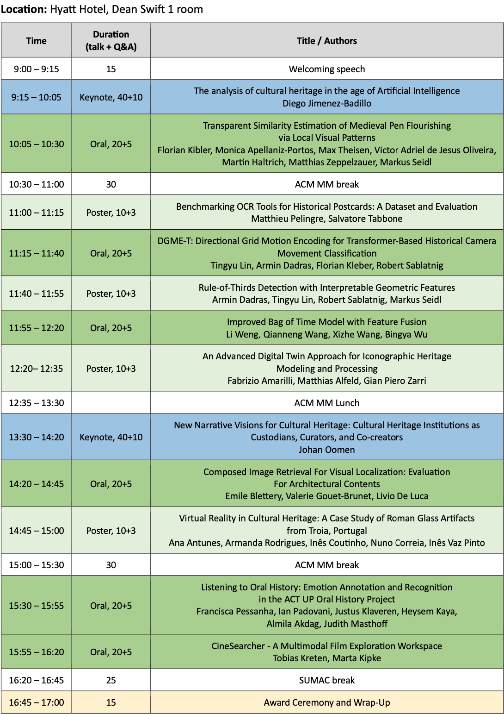
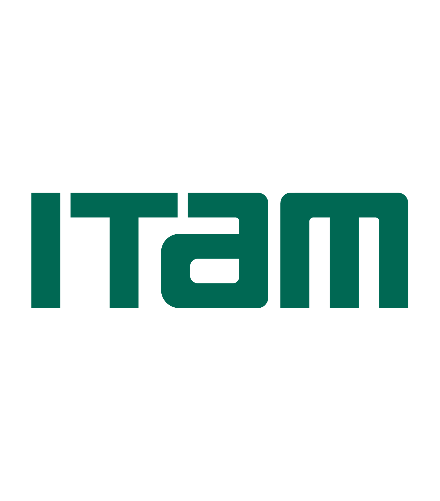

---
#
# By default, content added below the "---" mark will appear in the home page
# between the top bar and the list of recent posts.
# To change the home page layout, edit the _layouts/home.html file.
# See: https://jekyllrb.com/docs/themes/#overriding-theme-defaults
# <h3 class="blackpar_title">(Models, Training and Inference)</h3>
layout: home
---

	

		  
		<h2 class="blackpar_title">SUMAC 2025</h2>
		<h3 class="blackpar_title">The 7th workshop on analy<a style="color: rgb(164, 0, 0)">s</a>is, <a style="color: rgb(164, 0, 0)">u</a>nderstanding  and pro<a style="color: rgb(164, 0, 0)">m</a>otion of herit<a style="color: rgb(164, 0, 0)">a</a>ge <a style="color: rgb(164, 0, 0)">c</a>ontents</h3>
	    <h4 class="blackpar_title" style="font-family:'Source Pro'; font-weight: 400;"> Advances in machine learning, signal processing,  multimodal techniques and human-machine interaction</h4>
		<h5 class="blackpar_title" style="font-family:'Source Pro'; font-weight: 400;"><b>In conjunction with <a href="https://acmmm2025.org/"> ACM Multimedia 2025 </a>  27 October, 2025, Dublin, Ireland (On-Site)</b></h5>
		  	
	

 

<!-- News and Updates -->
<h2 class="blackpar_title" id="news">News and Updates</h2>

<ul>
	<li> <b>[30 Oct, 2025]</b> The proceedings are online: <a href="https://dl.acm.org/doi/proceedings/10.1145/3746273" target="new">it's here</a> </li>
	<li> <b>[27 Oct, 2025]</b> Best paper award goes to "Listening to Oral History: Emotion Annotation and Recognition in the ACT UP Oral History Project" <a href="https://dl.acm.org/doi/10.1145/3746273.3760204" target="new"> (ACM DL Link)</a>, presented by <b>Francisca Pessanha</b>. Congratulations! </li>
	<li> <b>[27 Oct, 2025]</b> <a href="index.html#d-day">D-Day!</a> What an amazing day that brought together our wonderful international community of multimedia heritage contents analysts in Dublin!</li>
	<li> <b>[23 Oct, 2025]</b> Zoom for online attendance: it's <a href="https://itam.zoom.us/j/95430040530?pwd=3LTKCVFJITAp00KyGlA5bgG6f3IokN.1">here</a>!</li>
	<li> <b>[06 Oct, 2025]</b> <a href="index.html#schedule">Schedule Announced!</a></li>
	<li> <b>[04 Aug, 2025]</b> Notifications released!</li>
	<li> <b>[21 Jul, 2025]</b> Important dates slightly modified, please check</li>
	<li> <b>[11 Jul, 2025]</b> Short deadline extension! Up to 14 July UTC-0</li>
	<li> <b>[09 Mar, 2025]</b> <a href="https://sumac-workshops.github.io/2025/">Website Launched!</a></li>
	<li> <b>[03 Apr, 2025]</b> <a href="https://openreview.net/group?id=acmmm.org/ACMMM/2025/Workshop/SUMAC">Submission site is open!</a></li> 
	<li><b>[11 April, 2025]</b> Deadlines extended.</li>
	<li><b>[26 May, 2025]</b> Keynote info updated.</li>
</ul>

<h2 class="blackpar_title" id="overview">Overview</h2>

 The seventh version of the SUMAC (analySis, Understanding and proMotion of heritAge Contents) workshop, like its predecessors, focuses on analyzing, processing and valorizing all types of data related to cultural heritage, including tangible and intangible heritage. As stated by UNESCO, cultural heritage provides societies with a wealth of resources inherited from the past, created in the present for the benefit of future generations. 

 Digital heritage data acquired are naturally massive and address a large diversity of monomodal modalities (text, structured referentials, image, video, 3D, music, sensor data). Their processing and promotion put into light several scientific challenges as well as various new use cases that are of topical interest today for the ACM Multimedia community, both for academics and industries. Like in the previous editions, we will strive to value the sharing of knowledge, algorithms and experiments; and also open source software and open data, by encouraging the submission of articles that promote this sharing policy. 

 Abundant heritage data is available in the most recent years. Older data, that can be called the big data of the past, are mostly locked -- they currently remain largely “hidden” from the public, in galleries, libraries, archives, museums or data producers' infrastructures. Processing heritage data to increase their visibility will act as a game changer and contribute to a large panel of communities, by enabling an outstanding pool of inter-operable data, not only as a service to citizens but also to public or private actors, by challenging the research methods at the crossing of computer science, artificial intelligence and digital humanities. 

 
<!-- Call for Papers -->
<h2 class="blackpar_title" id="call_for_papers">Call for Papers</h2>

 The ambition of SUMAC is to bring together researchers and practitioners from different disciplines to share ideas and methods on current trends in the analysis, understanding and promotion of heritage contents. These challenges are reflected in the corresponding sub-fields of machine learning, signal processing, multi-modal techniques and human-machine interaction. We welcome research contributions for the following (but not limited to) topics: 

<ul>
	<li> Monomodal analysis: image, text, video, 3D, music, sensor data and structured referentials</li>
	<li> Information retrieval for multimedia heritage</li>
	<li> Automated archaeology and heritage data processing</li>
	<li> Multi-modal deep learning and time series analysis for heritage data</li>
	<li> Heritage modeling, visualization, and virtualization</li>
	<li> Smart digitization and reconstruction of heritage data</li>
	<li> Open heritage data and bench-marking</li>
</ul>

The scope of targeted applications is extensive and includes:

<ul>
	<li>Analysis, archaeometry of artifacts</li>
	<li> Diagnosis and monitoring for restoration and preventive conservation</li>
	<li> Geosciences / Geomatics for cultural heritage</li>
	<li> Education</li>
	<li> Smart and sustainable tourism </li>
	<li> Urban planning</li>
	<li> Digital Twins</li>
</ul>
 

<h2 class="blackpar_title" id="imp_dates">Important dates</h2>

<ul>
 	<li>Paper submission: <b><del>June 13</del> <del>July 11</del> July 14, 2025 <a href="https://www.timeanddate.com/worldclock/timezone/utc">UTC-0</a></b></li>
	<li>Author acceptance notification: <del>July 24</del> August 4, 2025</li>
	<li>Camera-Ready: <del>August 3</del> August 20, 2025</li>
	<li>Workshop date: Oct. 27, 2025</li>
</ul>
 

<h2 class="blackpar_title" id="submission_guide">Submission guidelines</h2>

<b>Submission format</b>  All submissions must be original work not under review at any other workshop, conference, or journal. The workshop will accept papers describing completed work (full paper) as well as work in progress (short paper). Two submission formats are accepted:
<ul>
 <li> 4 pages plus 1-page reference (short paper);</li>
 <li> 8 pages plus up to 2-page reference (full paper).</li>
</ul> 
  They must be encoded as PDF using the ACM Article Template of the main conference ACM Multimedia 2025 <a href="https://acmmm2025.org/information-for-authors/"> (https://acmmm2025.org/information-for-authors/)</a>.

<b>Peer Review and publication in ACM Digital Library</b> Paper submissions must conform with the “double-blind” review policy. All papers will be peer-reviewed by experts in the field, they will receive at least two reviews. Acceptance will be based on relevance to the workshop, scientific novelty, and technical quality. Depending on the number, maturity and topics of the accepted submissions, the work will be presented via oral or poster sessions. The workshop papers will be published in the ACM Digital Library.

<b>Profile Registration</b> A registered profile at OpenReview (submissions' portal) is required to submit a paper.

IMP NOTES:
<ul>
	<li> New profiles created without an institutional email will go through a moderation process that can take up to two weeks.</li>
	<li> New profiles created with an institutional email will be activated automatically.</li>
</ul>

<b>Submissions' Site</b> <a href="https://openreview.net/group?id=acmmm.org/ACMMM/2025/Workshop/SUMAC">https://openreview.net/group?id=acmmm.org/ACMMM/2025/Workshop/SUMAC</a>

 

<!-- Special Highlights -->
<h2 class="blackpar_title" id="highlights">Special Highlights</h2>

 <b>Best Paper Award - </b>We will present a best paper award, accompanied with a certificate and a trophy, similar to previous editions. 

 <b>This year, the best paper award goes to "Listening to Oral History: Emotion Annotation and Recognition in the ACT UP Oral History Project", presented by Francisca Pessanha</b>. 

<!-- 
 <b>Journal Special Issue - </b>Authors of the best papers from SUMAC 2023 will be invited to submit an extended and improved version for consideration for Special Issue on Cultural Heritage in the Springer journal Multimedia Tools and Applications.

-->
 

<!--Confirmed Speakers-->
<h2 class="blackpar_title" id="speakers">Keynote Speakers</h2>



<h2 class="blackpar_title" id="accepted_papers">Accepted Papers</h2>

<ul>
<li> <b>Keynotes</b></li>
<ul> 
	<li>
		<i>The analysis of cultural heritage in the age of Ar@ficial Intelligence</i> - Diego Jimenez-Badillo
		<a href="https://dl.acm.org/doi/10.1145/3746273.3760211" target="new">(proceedings)</a>
		<a href="papers/slides/PDF_Presentation_SUMAC-27-10-2025_Diego_Jimenez-Badillo.pdf" target="new"> (presentation)</a>
	</li>
	<li>
		<i>New Narrative Visions for Cultural Heritage: Cultural Heritage Institutions as Custodians, Curators, and Co-creators</i> - Johan Oomen
		<a href="https://dl.acm.org/doi/10.1145/3746273.3760210" target="new">(proceedings)</a>
	</li>
</ul> 
<li> <b>Oral</b></li>
<ul> 
	<li>
		<i>Transparent Similarity Estimation of Medieval Pen Flourishing via Local Visual Patterns</i> - Florian Kibler, Monica Apellaniz-Portos, Max Theisen, Victor Adriel de Jesus Oliveira, Martin Haltrich, Matthias Zeppelzauer, Markus Seidl
		<a href="https://dl.acm.org/doi/10.1145/3746273.3760203" target="new">(proceedings)</a>
		<a href="papers/slides/kibler_transparent_similarity_estimation.pdf" target="new"> (presentation)</a>
	</li>
	<li> 
		<i>Listening to Oral History: Emotion Annotation and Recognition in the ACT UP Oral History Project</i> - Francisca Pessanha, Ian Padovani, Justus Klaveren, Heysem Kaya, Almila Akdag, Judith Masthoff 
		<a href="https://dl.acm.org/doi/10.1145/3746273.3760204" target="new">(proceedings)</a>
		<a href="papers/slides/SUMAC_Francisca_Pessanha.pdf" target="new"> (presentation)</a>
	</li> 
	<li> 
		<i>Composed Image Retrieval For Visual Localization: Evaluation For Architectural Contents</i> - Emile Blettery, Valerie Gouet-Brunet, Livio De Luca
		<a href="https://dl.acm.org/doi/10.1145/3746273.3760200" target="new">(proceedings)</a>
		<a href="papers/slides/PresentationSumac2025_Blettery_Static.pdf" target="new"> (presentation)</a>
	</li>
	<li> 
		<i>Improved Bag of Time Model with Feature Fusion</i> - Li Weng, Qianneng Wang, Xizhe Wang, Bingya Wu
		<a href="https://dl.acm.org/doi/10.1145/3746273.3760206" target="new">(proceedings)</a>
		<a href="papers/slides/Improved_ Li_Weng.pdf" target="new"> (presentation)</a>
	</li>
	<li> 
		<i>CineSearcher - A Multimodal Film Exploration Workspace</i> - Tobias Kreten, Marta Kipke
		<a href="https://dl.acm.org/doi/10.1145/3746273.3760207" target="new">(proceedings)</a>
		<a href="papers/slides/CineSearcher.pdf" target="new"> (presentation)</a>
	</li>
	<li> 
		<i>DGME-T: Directional Grid Motion Encoding for Transformer-Based Historical Camera Movement Classification</i> - Tingyu Lin, Armin Dadras, Florian Kleber, Robert Sablatnig
		<a href="https://dl.acm.org/doi/10.1145/3746273.3760209" target="new">(proceedings)</a>
		<a href="papers/slides/DGMET_Tingyu_LIN.pdf" target="new"> (presentation)</a>
	</li>
</ul>
<li> <b>Poster</b></li>
<ul>
	<li> 
		<i>Benchmarking OCR Tools for Historical Postcards: A Dataset and Evaluation</i> - Matthieu Pelingre and Salvatore Tabbone
		<a href="https://dl.acm.org/doi/10.1145/3746273.3760201" target="new">(proceedings)</a>
		<a href="papers/slides/Presentation SUMAC - Postcards BenchmarkOCR_small.pdf" target="new"> (presentation)</a>
	</li>
	<li> 
		<i>Rule-of-Thirds Detection with Interpretable Geometric Features</i> - Armin Dadras, Tingyu Lin, Robert Sablatnig, Markus Seidl
		<a href="https://dl.acm.org/doi/10.1145/3746273.3760202" target="new">(proceedings)</a>
		<a href="papers/slides/rot_detection_dadras.pdf" target="new"> (presentation)</a>
	</li>
	<li> 
		<i>An Advanced Digital Twin Approach for Iconographic Heritage Modeling and Processing</i> - Fabrizio Amarilli, Matthias Alfeld, Gian Piero Zarri
		<a href="https://dl.acm.org/doi/10.1145/3746273.3760208" target="new">(proceedings)</a>
		<a href="papers/slides/Amarilli_SUMAC_2025.pdf" target="new"> (presentation)</a>
	</li>
	<li> 
		<i>Virtual Reality in Cultural Heritage: A Case Study of Roman Glass Artifacts from Troia, Portugal</i> - Ana Antunes, Armanda Rodrigues, Inês Coutinho, Nuno Correia, Inês Vaz Pinto 
		<a href="https://dl.acm.org/doi/10.1145/3746273.3760205" target="new">(proceedings)</a>
		<a href="papers/slides/PresentationAna_Antunes_SUMAC_2025.pdf" target="new"> (presentation)</a>
	</li>
</ul>
</ul>
 

<!-- Schedule -->

<h2 class="blackpar_title" id="schedule">Schedule (Dublin local time, 27 October) </h2>

<!-- 
 <b>Keynotes</b>: 40 min talk + 10 min Q&A
 

 <b>Orals</b>: 20 min talk + 5 min Q&A
 

 <b>Posters</b>: 10 min talk + 3 min Q&A



 

 <b>Zoom for online attendance:</b> <a href="https://itam.zoom.us/j/95430040530?pwd=3LTKCVFJITAp00KyGlA5bgG6f3IokN.1">here</a>
-->

	

  

<!-- D-Day -->

<h2 class="blackpar_title" id="d-day">D-Day</h2>

	

    

<!-- Technical Committee -->
<h2 class="blackpar_title" id="program_committee">Program Committee</h2>



 

<!-- Organizers -->
<h2 class="blackpar_title" id="organizers">Organizers</h2>



 

<h2 class="blackpar_title">Sponsors</h2>

	

		

			
		

	

	

		

			
		

	

	

		
		
			
		

	

	

		

			
		

	

 

<!-- <h2 class="blackpar_title">Gold Sponsor</h2>

	

		

			
		

	

	

		

			
		

	

 -->

<!-- Technical Committee -->
<h2 class="blackpar_title" id="previous_editions">Previous Editions</h2>



